# 📊 Training Intelligence Dashboard (GenAI PoC)

A premium, protocol-compliant AI analytics platform designed for workforce training and compliance oversight. This Proof of Concept demonstrates a robust integration of **Model Context Protocol (MCP)**, **Amazon Bedrock**, **AWS DynamoDB**, and **PostgreSQL** within a professional Streamlit dashboard featuring **Bcrypt-Encrypted Authentication** and **Role-Based Access Control (RBAC)**.

---

## 🚀 Key Features

- **Role-Based Access Control (RBAC)**: Multi-tiered data access scoping for 3 distinct organizational roles:
  - **Super User (`OFF001`)**: Full system-wide access across all 5 office locations.
  - **Learning Administrator (`LAD001`)**: Single office scope.
  - **Employee (`EMP001`)**: Personal scope restricted to self course transcripts and required curriculum.
- **Bcrypt Password Authentication**: Encrypted credential verification backed by `bcrypt` hashes stored in `config/users_auth.json`.
- **MCP-Native Architecture**: Decoupled backend services exposed via the Model Context Protocol, ensuring scalability and standardized tool integration.
- **Generative Insights**: Natural language data exploration powered by Claude 4.6 Sonnet on Amazon Bedrock.
- **Persistent Conversations**: Full chat history persistence using **AWS DynamoDB**, allowing users to save, load, and manage multiple analysis sessions.
- **Smart Name Resolution & Semantic Matching**: Automatic conversion of human names into internal identifiers, and intelligent query mapping that bridges the gap between natural language (e.g. "teams") and database schemas (e.g. "job families").
- **High-Performance UI**: Optimized Streamlit rendering using `@st.cache_resource` for service connections, `@st.cache_data` for heavy queries, and `st.fragment` for instantaneous, localized chat updates without full-page reloads.
- **Executive Dashboards**: High-fidelity visualizations (Plotly) and executive summaries optimized for dark-mode professional environments, featuring a public default landing view and role-scoped portals.
- **Automated Compliance Analysis**: Real-time gap analysis for mandatory training curriculums across the workforce.
- **Dual-Layer Safety Guardrails**: Built-in zero-latency profanity keyword filtering combined with LLM-driven "Scope Guardrails" that proactively reject out-of-bounds topics.

---

## 🔐 Demo Credentials

| Role | Username / User ID | Test Password | Scope & Access Level |
| :--- | :--- | :--- | :--- |
| **Super User** | `OFF001` | `OfficerPass123!` | System-Wide (All 5 Cities: SF, LA, Seattle, Portland, Salt Lake City) |
| **Learning Administrator** | `LAD001` | `AdminPass123!` | Assigned Office Only (**Los Angeles**) |
| **Employee** | `EMP001` | `EmpPass123!` | Personal Self Scope (**Evan Park** transcripts & curriculum) |

*Note: All passwords stored in `config/users_auth.json` are encrypted using `bcrypt` salted hashes (`$2b$12$...`).*

---

## 📐 System Architecture

```mermaid
flowchart LR
    %% Presentation & Auth Subgraph
    subgraph PRESENTATION ["🖥️ PRESENTATION & SECURITY LAYER"]
        direction TB
        USER["👤 <b>User Persona</b><br/>Officer | Admin | Employee"]
        AUTH["🔐 <b>Bcrypt Auth Gate</b><br/><code>config/users_auth.json</code>"]
        APP["🧭 <b>Streamlit Dashboard</b><br/><code>ui/app.py</code><br/>• Executive Plotly Visuals<br/>• Role Scoping Engine"]
        
        USER -->|"Credentials"| AUTH
        AUTH -->|"Authenticated Session"| APP
    end

    %% Protocol & Orchestration Subgraph
    subgraph ORCHESTRATION ["⚡ PROTOCOL & SERVICE ORCHESTRATION"]
        direction TB
        ROUTER["🤖 <b>AI Service Router</b><br/><code>src/services/ai_service.py</code><br/>• Query Intent Classifier<br/>• Code Viz Generator"]
        MCP_CLIENT["🔌 <b>UI MCP Client</b><br/><code>src/mcp_client.py</code>"]
        MCP_SERVER["⚙️ <b>FastMCP Server</b><br/><code>src/mcp_server.py</code>"]
        DATA_SVC["📊 <b>Data Service Engine</b><br/><code>src/services/data_service.py</code><br/>• Scoped SQL Execution<br/>• Smart Name Resolution"]
        HIST_SVC["💾 <b>History Service</b><br/><code>src/services/history_service.py</code><br/>• User Isolated History"]
        
        APP -->|"User Query + Scope"| ROUTER
        APP -->|"MCP Requests"| MCP_CLIENT
        MCP_CLIENT -->|"Protocol Call"| MCP_SERVER
        MCP_SERVER -->|"Execute Tool"| DATA_SVC
        APP -->|"Save / Load State"| HIST_SVC
    end

    %% Data & Cloud Infrastructure Subgraph
    subgraph INFRASTRUCTURE ["☁️ CLOUD & DATA INFRASTRUCTURE"]
        direction TB
        BEDROCK["🧠 <b>Amazon Bedrock</b><br/><code>Claude 4.6 Sonnet</code>"]
        POSTGRES[("🐘 <b>AWS RDS PostgreSQL</b><br/><code>trainingdb schema</code><br/>• employee_fact<br/>• catalog_fact<br/>• curriculum_fact<br/>• transcript_fact")]
        DYNAMO[("⚡ <b>AWS DynamoDB</b><br/><code>FedCashChatHistory</code>")]
        
        ROUTER -->|"Bedrock API"| BEDROCK
        DATA_SVC -->|"Scoped SQL Queries"| POSTGRES
        HIST_SVC -->|"Session Put / Get"| DYNAMO
    end

    %% Inter-layer Flow Connections
    PRESENTATION ==> ORCHESTRATION ==> INFRASTRUCTURE

    %% Custom Executive Styling
    classDef presStyle fill:#0f172a,stroke:#3b82f6,stroke-width:2px,color:#f8fafc;
    classDef orchStyle fill:#1e1b4b,stroke:#8b5cf6,stroke-width:2px,color:#f8fafc;
    classDef infraStyle fill:#064e3b,stroke:#10b981,stroke-width:2px,color:#f8fafc;

    class USER,AUTH,APP presStyle;
    class ROUTER,MCP_CLIENT,MCP_SERVER,DATA_SVC,HIST_SVC orchStyle;
    class BEDROCK,POSTGRES,DYNAMO infraStyle;
```



---

## 🏗️ Project Structure

```text
genai-poc/
├── config/
│   └── users_auth.json    # Encrypted bcrypt password hashes & user roles
├── scripts/
│   └── generate_hash.py   # Utility script to generate/verify bcrypt password hashes
├── src/
│   ├── mcp_server.py      # FastMCP Server (exposes data tools)
│   ├── mcp_client.py      # Thread-safe UI Client for Streamlit
│   ├── services/
│   │   ├── ai_service.py      # Routing logic & Viz generation
│   │   ├── data_service.py    # PostgreSQL query engine & Name resolution
│   │   └── history_service.py # DynamoDB persistence layer
│   └── utils/             # AWS/Config utilities
├── ui/
│   └── app.py             # Streamlit Dashboard application & Authentication Gate
├── terraform/             # Cloud Infrastructure (DynamoDB, IAM)
└── sql/                   # DDL & Data Ingestion scripts
```

---

## 🛠️ Getting Started

### 1. Prerequisites

Before starting, ensure you have the following installed and configured:
- **Python 3.13+**
- **uv package manager** (`pip install uv`)
- **Terraform** (to provision AWS resources)
- **AWS CLI** (configured with your AWS credentials)
- **PostgreSQL Client / psql** or **pgAdmin**

**AWS Configuration**:
Configure your AWS credentials using the AWS CLI so that Terraform and the application can access AWS resources:
```bash
aws configure
# Or using AWS SSO: aws sso login --profile <your_profile_name>
```

---

### 2. Infrastructure Provisioning with Terraform

Use Terraform to automatically provision the required AWS resources, such as DynamoDB tables and IAM roles.

1. Navigate to the terraform directory:
   ```bash
   cd terraform
   ```
2. Initialize Terraform:
   ```bash
   terraform init
   ```
3. Apply the configuration to create the resources:
   ```bash
   terraform apply
   ```

---

### 3. Database Setup and Data Population

1. **Create Database Tables**:
   Execute `sql/ddl/create_database_tables.sql` against your PostgreSQL database (`trainingdb`):
   ```bash
   psql -h <YOUR_RDS_HOST> -p 5432 -U postgres -d trainingdb -f sql/ddl/create_database_tables.sql
   ```

2. **Populate Synthetic Data**:
   Run the PowerShell script to load all synthetic seed CSV data:
   ```powershell
   cd sql\ddl
   .\load_database_data.ps1
   ```

---

### 4. Application Installation and Execution

1. **Synchronize Dependencies with `uv`**:
   From the project root directory, install all required dependencies (including `bcrypt`):
   ```bash
   uv sync
   ```

2. **Environment Configuration**:
   Create a `.env` file in the root directory:
   ```env
   # PostgreSQL Connection String (RDS)
   DATABASE_URL="postgresql://postgres:<password>@<your-rds-endpoint>:5432/trainingdb?options=-c%20search_path%3Dtraining"

   # Amazon Bedrock Configuration
   AWS_REGION=us-east-1
   MODEL_ID=global.anthropic.claude-sonnet-4-6
   AWS_PROFILE=default
   ```

3. **Run the Application with `uv`**:
   Start the Streamlit dashboard using `uv`:
   ```bash
   uv run streamlit run ui/app.py
   ```

4. **Managing Password Hashes**:
   To generate a new bcrypt password hash for any user, run:
   ```bash
   uv run python scripts/generate_hash.py <your_password>
   ```

---

## 🧪 Technology Stack

- **Frontend & Authentication**: Streamlit (Dashboard, RBAC, Bcrypt Auth)
- **Security & Encryption**: Bcrypt (Password Hashing)
- **AI Backend**: Amazon Bedrock (Claude 4.6 Sonnet)
- **Database**: PostgreSQL (Structured Workforce & Training Data), AWS DynamoDB (Chat History)
- **Communication**: Model Context Protocol (MCP) via FastMCP
- **Visualization**: Plotly Express (Dark Mode Executive Charts)

---

## 🛡️ Compliance & Safety

This PoC incorporates **Dual-Layer Safety Guardrails**:
1. **Zero-Latency Keyword Filter**: Intercepts obvious toxicity and profanity entirely in-memory before invoking expensive network or API calls.
2. **Scope Guardrails**: The routing LLM actively determines user intent and rejects queries completely unrelated to workforce training, HR, or compliance via specialized tool calls.
3. **Role Enforcement**: User session data is hard-scoped based on role (`Officer`, `Learning Admin`, `Employee`), ensuring non-admin roles cannot query data outside their authorized scope.
